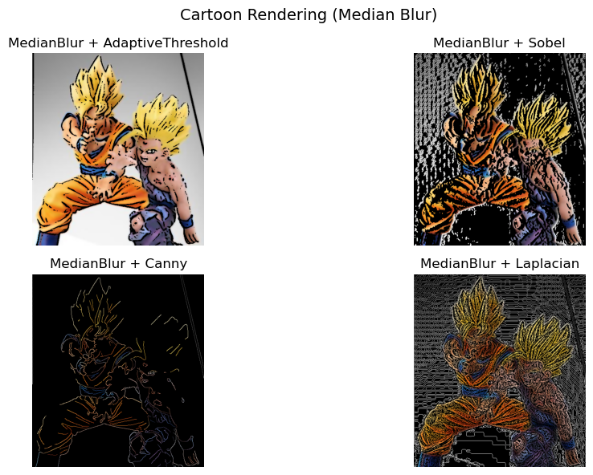
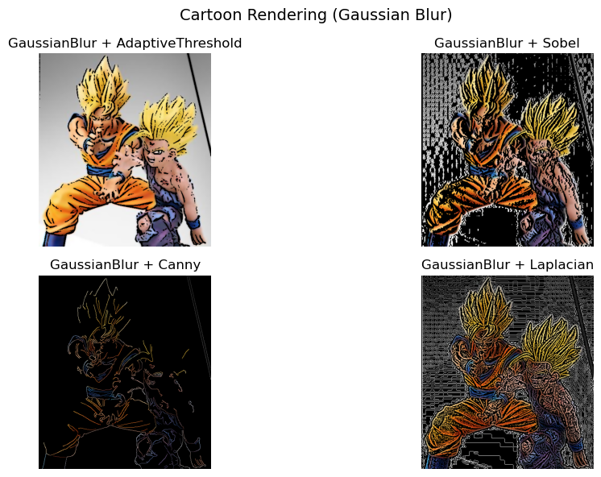
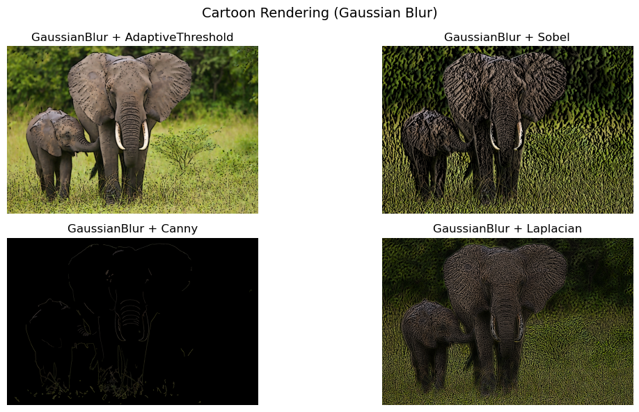
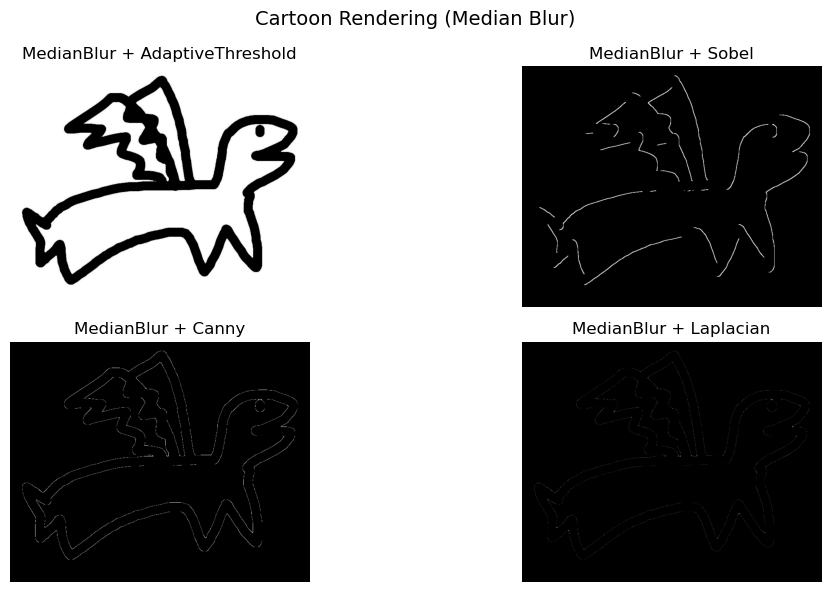

# CartoonRenderingComparison
Comparison of cartoon rendering effects using OpenCV: Median/Gaussian blur with 4 edge filters (AdaptiveThreshold, Sobel, Canny, Laplacian)

OpenCV를 활용한 다양한 필터 기반 Cartoon Rendering 효과 비교 프로그램

# 주요 기능
이미지를 만화 스타일로 변환하는 알고리즘의 다양한 블러 - 필터 조합을 테스트해서 비교할 수 있다.

cv.imread()에 원하는 이미지의 경로를 입력해 만화 같은 느낌이 잘 표현되는 이미지와 잘 표현되지 않는 이미지를 비교할 수 있다.

총 8개의 조합으로 렌더링한 결과를 비교한다.
- Median Blur + Adaptive Threshold
- Median Blur + Sobel
- Median Blur + Canny
- Median Blur + Laplacian
- Gaussian Blur + Adaptive Threshold
- Gaussian Blur + Sobel
- Gaussian Blur + Canny
- Gaussian Blur + Laplacian

matplotlib을 사용해 결과를 시각화 하고 (cv.imshow()로도 시각화 할 수 있다)

cv.imwrite()에 원하는 저장 경로를 입력해 개별 이미지 8개를 각각 저장한다

# 렌더링 과정

## Grayscale - 흑백처리
명암 정보를 통해 윤곽선을 검출하기 위해 채널을 1개로 줄인다

## Blur - 노이즈 제거
Median Blur

- 주변 픽셀의 중앙값을 사용하여 노이즈를 제거한다.
- salt & pepper 노이즈 제거에 효과적이며 윤곽선을 잘 보존한다.

Gaussian Blur

- gaussian kernel을 이용해 가중치를 적용하여 노이즈를 제거한다.
- 연속적인 노이즈 감소에 유리하다.

## Edge Detection - 윤곽선 검출
AdaptiveThreshold

- 이미지의 밝기에 따라 임계값을 적용하여 이진화해 윤곽선을 검출한다
- 조명이 불균일한 경우나 그림자가 있을 때 유리하다.

Sobel Filter

- 수평/수직 기울기를 이용하여 윤곽선을 검출한다
- 밝기 변화가 큰 경우 유리하다.

Canny Filter

- gradient, 최대비 억제, hysteresis 여러 단계를 거쳐 윤곽선을 정교하게 검출한다.
- 노이즈에 강하며 정확하고 깔끔한 윤곽선 검출에 유리하다.

Laplacian Filter

- 두 번 미분을 통해 변곡점을 이용하여 윤곽선을 검출한다.
- 노이즈에 민감하고 경계가 두드러지는 경우 유리하다.

## BilateralFilter
공간적 거리와 색상 거리를 고려한다.
윤곽선을 유지하면서 색상을 부드럽게 처리한다.

### Bitwise
윤곽선과 색상을 결합한다.
최종적으로 윤곽선은 뚜렷하고 내부 색상은 부드러운 카툰 렌더링 이미지를 완성한다.

# 결과 비교

## 피규어 이미지
명확한 경계와 단순한 배경으로 윤곽선 처리와 부드러운 색감이 비교적 잘 반영되어 만화같은 느낌이 잘 표현되는 편이다.

### Median Blur

### Gaussian Blur

## 실사 이미지
흐릿한 경계와 복잡한 배경으로 코끼리의 형태는 어느정도 남지만 과도하게 강조되거나 뭉개지는 경향이 있다.

### Median Blur

### Gaussian Blur

## 스케치 이미지
매우 뚜렷한 경계를 가지며 내부 색상이 없는 단색 이미지로 효과가 거의 없다.

### Median Blur

### Gaussian Blur

# 비교 결론

Gaussian Blur를 사용한 이미지가 Median Blur를 사용한 이미지보다 좀 더 형태를 잘 나타낸다.

대부분 Adaptive Threshold가 가장 만화같은 스타일을 잘 나타낸다.

Canny Filter는 복잡한 배경에서도 물체의 선을 잘 추출해 내지만 색감 처리에선 어둡게만 나타낸다.

Laplacian, Sobel Filter는 배경과 물체 내부의 선을 과도하게 나타낸다.

# 알고리즘의 한계점

이미지의 종류에 따른 성능 차이가 크다
- 배경이 단순하고 선이 명확해야 하면서도 뚜렷한 선만으로 이루어진 이미지에는 잘 적용되지 못한다.

일부 필터는 색상 보존이 되지 않는 경우가 있다
- 너무 어둡거나 배경을 검은색으로 만드는 필터들이 있다.

최적화 부족
- 이미지의 특징에 따른 적절한 Blur, Filter에 자동 매칭이 없어 비교 용도와 특정 이미지에 대한 렌더링만 제대로 가능하다.

성능 부족
- AI 기반 고급 알고리즘에 비해 낮은 성능을 보인다.
- 실행 속도면에서는 유리할 수 있다.
